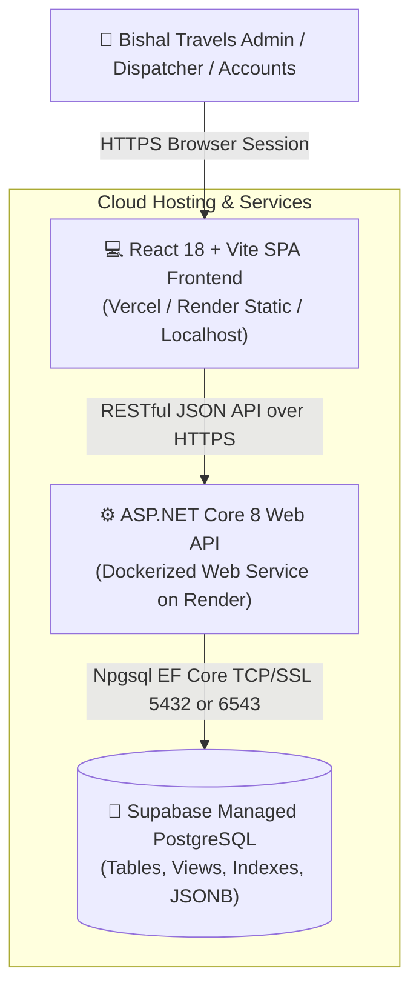
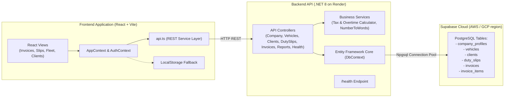
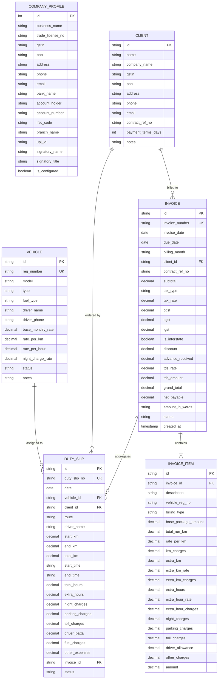

# Technical Architecture Document (architecture.md)

**Project:** Bishal Travels Fleet & Invoice Management System (.NET + Supabase + Render)  
**Authoring Engine:** BMAD Architecture Engine (v2.4.0)  
**Status:** Approved  
**Last Updated:** 2026-09-26  

---

## 1. Executive Summary & Architectural Goals
This document specifies the technical architecture for the **Bishal Travels** enterprise travel invoicing and fleet management solution. It defines the migration from a local-only browser model to a cloud-native architecture combining an **ASP.NET Core 8 Web API** backend, a managed **Supabase PostgreSQL** database, a zero-maintenance containerized deployment on **Render**, and seamless bi-directional integration with the **React + Vite + TypeScript** frontend.

### Core Architectural Drivers
- **Financial Precision:** Strict decimal arithmetic (`decimal(18,2)`) in C# and PostgreSQL for all GST tax calculations, TDS deductions, and advance amounts.
- **Relational Integrity:** Foreign keys linking Invoices to DutySlips, Clients, and Vehicles with idempotent update semantics.
- **High Availability & Low Cost:** Render Web Service container auto-healing paired with Supabase PostgreSQL connection pooling.
- **Resilient Hybrid Sync:** Frontend client executes against the cloud API as primary source of truth, with graceful fallback to browser storage when disconnected.

---

## 2. System Context & C4 Architecture Diagrams

### C4 Level 1: System Context Diagram



### C4 Level 2: Container & Service Interaction Diagram



---

## 3. Database Schema (Supabase PostgreSQL ERD)



---

## 4. Render Deployment Architecture

```
                               ┌───────────────────────────┐
                               │   GitHub Repository       │
                               │   (master / main)         │
                               └─────────────┬─────────────┘
                                             │ git push
                                             ▼
                               ┌───────────────────────────┐
                               │   Render Web Service      │
                               │   (Docker Environment)    │
                               ├───────────────────────────┤
                               │ • Multi-stage Docker build│
                               │ • Exposes PORT ($PORT)    │
                               │ • /health probe check     │
                               │ • Environment Variables:  │
                               │   - ConnectionStrings__   │
                               │     DefaultConnection     │
                               │   - ASPNETCORE_ENV=...    │
                               └─────────────┬─────────────┘
                                             │
                                             ▼
                               ┌───────────────────────────┐
                               │ Supabase Cloud PostgreSQL │
                               │ (aws-0-ap-south-1.pooler) │
                               └───────────────────────────┘
```

---

## 5. Architectural Decision Records (ADRs)

| ADR ID | Decision | Justification | Alternatives Considered |
| :--- | :--- | :--- | :--- |
| **ADR-001** | ASP.NET Core 8 Web API Framework | Enterprise-grade speed, native async I/O, built-in dependency injection, cross-platform Docker containerization. | Node/Express, Python FastAPI, Go Fiber |
| **ADR-002** | Supabase Managed PostgreSQL | Managed cloud PostgreSQL with automated backup, connection pooler (PgBouncer/Supavisor), and free tier. | Self-hosted PostgreSQL on VM, MongoDB, SQLite |
| **ADR-003** | Render Cloud Web Service | Native Docker build support, automatic SSL, free/starter tiers, continuous deployment on Git push. | AWS ECS, Azure App Service, Heroku |
| **ADR-004** | Dual Storage Strategy (API Primary + LocalStorage Fallback) | Ensures zero user disruption if internet connectivity drops during duty slip logging in transit. | Pure online-only (fails offline), Pure local (no cross-device sync) |
| **ADR-005** | Standalone SQL DDL Script + EF Core Auto-Migration | Allows instant schema creation in Supabase SQL editor without demanding CLI tools from non-technical operators. | Pure code-first migrations requiring `dotnet ef` tools |

