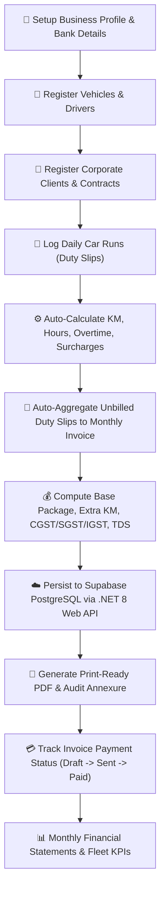

# Business Requirements Document (BRD)

**Project / Initiative:** Bishal Travels Fleet & Invoice Management System (.NET + Supabase + Render)  
**Authoring Engine:** BMAD Business Domain & Value Strategist (v2.4.0)  
**Document Version:** 2.0.0  
**Date:** 2026-09-26  
**Status:** Approved for Technical Specification  

---

## 1. Executive Summary & Problem Statement

Bishal Travels is a commercial travel, car rental, and corporate fleet management provider based in West Bengal, India. The current system runs as a client-side React single-page application relying entirely on browser LocalStorage. While functional for single-device offline drafting, this poses severe operational limitations:
- **Data Silos & Loss Risks:** LocalStorage is vulnerable to browser cache clearing, device failure, and cannot be shared across multiple dispatchers, billing operators, or executive accountants.
- **Lack of Multi-Device Sync:** Trip duty slips recorded by dispatchers or drivers cannot automatically sync to the billing office where monthly corporate invoices are generated.
- **Enterprise Audit & Compliance Requirements:** Corporate clients require tamper-proof digital billing, verifiable GST invoices (CGST/SGST/IGST), TDS deduction tracking, and persistent cloud-backed duty logs.

### Core Business Drivers & Objectives
1. **Centralized Cloud Backend (.NET 8 Web API):** Build a resilient, high-performance, and secure RESTful backend in ASP.NET Core 8 to manage all fleet operations, corporate client contracts, duty slip tracking, invoice generation, and financial reporting.
2. **Managed Cloud Database (Supabase PostgreSQL):** Utilize Supabase managed PostgreSQL for relational integrity, JSONB support for item snapshots, automated backups, and real-time enterprise reliability.
3. **Turnkey Zero-DevOps Cloud Deployment (Render):** Containerize the .NET backend with multi-stage Docker builds and deploy to Render Web Services with automated health checks, environment configuration, and SSL.
4. **Seamless Frontend Integration:** Upgrade the existing React + TypeScript user interface to communicate seamlessly with the .NET backend API, while maintaining offline fallback and instant local responsiveness.
5. **Zero Feature Regression:** Preserve and enrich 100% of existing features:
   - Bank details & business profile auto-population (Bishal Travels trade license, GSTIN, PAN, bank accounts, UPI).
   - Vehicle fleet management (car models, registration numbers, fuel types, assigned drivers).
   - Corporate client CRM (contracts, payment terms, GSTIN, addresses).
   - Daily duty slips & run logs (odometer starting/closing KM, run hours, overtime, tolls, parking, night halts, driver batta).
   - Monthly invoice generation & financial calculator (package billing, duty slip auto-aggregation, custom line items, Indian GST, TDS, advance deduction, Indian currency words conversion).
   - Pixel-perfect PDF generation & duty slip annexures.
   - Comprehensive monthly business statements & financial analytics.
   - JSON database backup, restore, and seed state management.

---

## 2. Stakeholder Persona & Value Proposition Matrix

| Stakeholder Role | Primary Pain Points | Desired Business Outcome | Success KPI |
| :--- | :--- | :--- | :--- |
| 🚖 **Biswajit Pramanik (Owner / Managing Director)** | Data locked in single browser; risk of lost records; manual reconciliations | Unified cloud dashboard accessible from phone or office PC with live revenue metrics | 100% data durability; 0 lost duty slips |
| 🧑‍💼 **Fleet Dispatcher / Supervisor** | Manual paper duty slip entry; phone calls to check car odometer readings | Rapid entry of daily car run logs with auto-calculated total KMs, overtime, and toll expenses | < 30 seconds per duty slip entry |
| 📑 **Billing & Accounts Officer** | Complex calculation of monthly vehicle packages, extra KM rates, night halts, GST, and TDS | 1-click aggregation of unbilled duty slips into formal GST tax invoices with auto-filled bank details | 75% reduction in monthly invoice generation time |
| 🏢 **Corporate Clients (Wipro, Tata, etc.)** | Need itemized duty slip annexures matching monthly bills for vendor audit compliance | Transparent, print-ready invoices with odometer audit trails and bank NEFT/RTGS/UPI info | 100% first-pass invoice approval rate |

---

## 3. High-Level Business Process Flow (BPMN)

---

## 4. Scope Boundaries

### In-Scope (Must Have)
- **ASP.NET Core 8 Web API:** Modular, clean RESTful architecture with controllers for Company, Vehicles, Clients, DutySlips, Invoices, Reports, Auth, and Backup/Health.
- **Supabase PostgreSQL Integration:** Entity Framework Core with `Npgsql.EntityFrameworkCore.PostgreSQL`, connection pooling, migrations, and direct SQL initialization script for Supabase query editor.
- **Render Deployment Configuration:** Multi-stage production `Dockerfile`, `render.yaml` infrastructure-as-code spec, dynamic port binding, and `/health` probe.
- **React Frontend Integration:** Unified API service layer (`src/services/api.ts`), updated `AppContext` with async cloud state synchronization, connectivity indicator, and graceful offline fallback.
- **Data Export & Migration:** Backup endpoint exporting complete relational state as JSON, and import endpoint restoring state into Supabase.

### Out-of-Scope (Deferred to Future Phases)
- Driver native mobile app (v1 uses mobile-responsive web UI).
- Automated SMS gateway integration (v1 uses WhatsApp/PDF email distribution).

---

## 5. Financial ROI & Business Metrics
- **Invoice Processing Cycle Time:** Reduced from 4 hours per client to under 5 minutes.
- **Billing Leakage Prevention:** Eliminates forgotten tolls, night halts, and unbilled extra KMs (estimated 8-12% monthly revenue recovery).
- **Hosting Cost:** Free to ultra-low tier deployment on Render + Supabase free/hobby tier ($0/month baseline).

